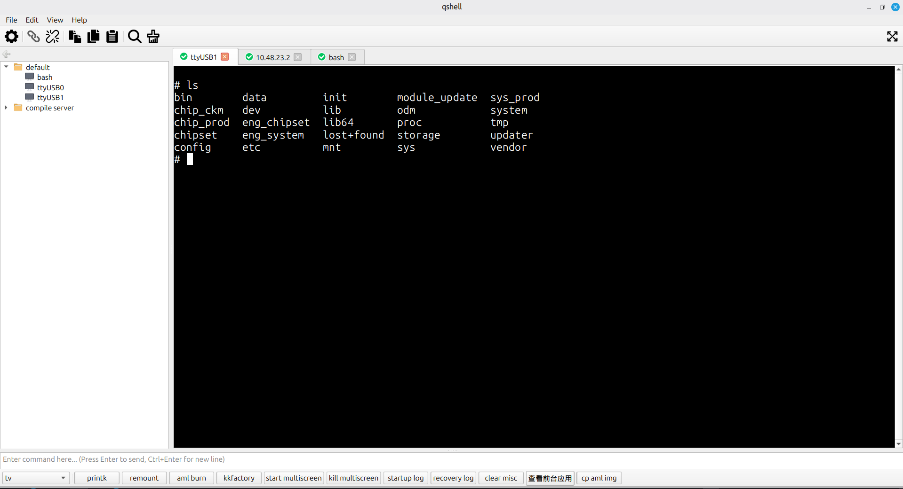

# qshell
跨平台的终端管理工具，类似 xshell/SecureCRT/mobaxterm 的终端管理工具，目前支持 linux, windows, macos 平台
支持协议：串口，ssh，local-shell

已实现特性：
- 会话管理
- 多标签
- 日记保存
- Button Bar
- Command Window

## 安装
可以从 github release 页面下载最新版本的安装包
[qshell-release](https://github.com/qiushao/qshell/releases)

## 编译运行
请参考 [BUILD.md](BUILD.md)

## 感谢
本项目代码引用或部份参考或依赖了以下开源项目，并在此表示感谢。
- [qtermwidget](https://gitee.com/QQxiaoming/qtermwidget)
- [libssh2](https://github.com/libssh2/libssh2)
- [ptyqt](https://github.com/kafeg/ptyqt)
- [utf8proc](https://github.com/JuliaStrings/utf8proc)
